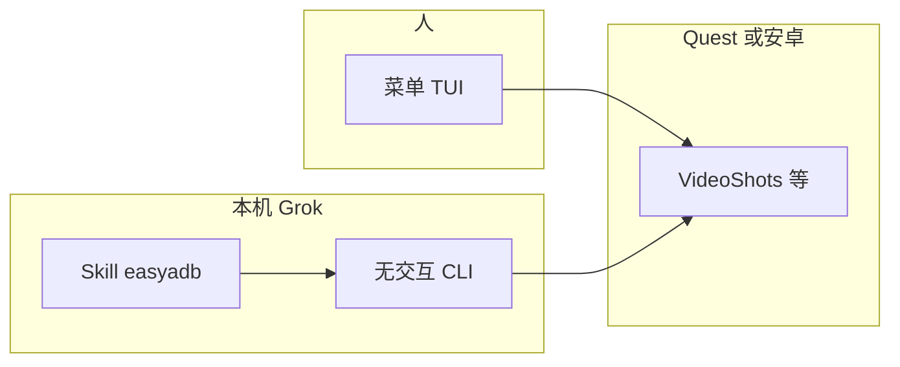
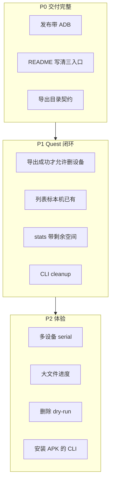

#产品 #EasyADB #Quest #设计文档/产品蓝图

> 最后修订：2026-08-27
> 作者：李鹏举 | AI Assistant
> 目标：固定 EasyADB 的产品形态、入口边界，以及后续只补闭环、不做窗口 GUI 的决策

# EasyADB 产品蓝图

## 阅读建议

- **自己用 / 对 Grok 说话**：读「产品是什么」+「两条入口」即可。
- **改代码前**：读「核心设计思想」+「后续工作优先级」。P0 未完成前不要开 P2。
- **有人提做 App / 图形界面**：先读「不做窗口 GUI」整节，再决定是否推翻。

---

## 1. 产品是什么

EasyADB 是给 **本机 + Quest（及安卓）** 用的文件管家，主线是录屏进出：

- 列出、统计、按日期/来源过滤
- 导出到本机固定目录
- 点名删除或按保留天数清理
- 安装 APK（菜单或拖到 exe）

不是通用安卓文件浏览器，不是云同步，也不是给完全不碰电脑的人用的消费级 App。

当前真实用户就两类：**人自己点菜单**，**人对着本机 Grok 说一句话**。产品形态必须同时服务这两类，而且不能做成两套互相打架的逻辑。

为什么看下面这张图：先分清「谁在用、走哪条入口」，后面所有优先级都从这张图来。



关键点：Agent **禁止**进无参数菜单；菜单给人点选。两边必须调用同一套列目录 / 导出 / 删除实现，禁止再写一份 adb 解析。

---

## 2. 以前、现在、为什么、未来

**以前**：只有交互菜单。能导、能删、能清、能装包。人要用方向键；AI 无法可靠「勾选」。

**现在**：菜单仍在。另外加了无交互 CLI（JSON stdout）和用户级 Skill（`~/.claude/skills/easyadb`，不放 `.grok`）。已验证：列最近 10 天、按精确文件名删除。

**为什么变**：主路径变成「说出今天最后一个 / 最近 10 天有哪些」。菜单勾选服务不了这句话。CLI 是机器接口，Skill 只教 Agent 何时调哪条命令，不实现 ADB。

**未来**：把 Quest 存储闭环做完（导出落点稳定、导完可删设备、能看见剩余空间和「本机已有」），而不是换一层窗口。窗口 GUI 明确排除，见第 4 节。

---

## 3. 核心设计思想

1. **一个产品，两个门面，一套内核**  
   TUI 与 CLI 共享扫描、过滤、pull、rm。Skill 只引用 CLI，不手写 `adb ls`。

2. **主线收窄到 Quest 录屏进出**  
   预设里可以有截图 / DCIM / 下载，但默认和 Skill 主路径是 `videos`（`/sdcard/oculus/VideoShots` + `.mp4`）。做通用文件管理会稀释这件刚需。

3. **删除必须可追溯**  
   CLI 删除必须 `--yes`，且必须带过滤（`--name` / `--query` / `--date` 等）。禁止无条件全删。范围删除应先能 dry-run 看名单（后续补）。

4. **默认导出目录是产品契约，不是 cwd 副作用**  
   Agent 工作目录会变。导出必须落到配置里的本机仓库（当前实践是 `exe/Videos`），Skill 与 CLI 默认值必须一致。

5. **包装诚实**  
   文档写「内置 ADB、解压即用」，发布物就必须带上 adb。做不到就改文档，不要用「兼容层」假装成功。

---

## 4. 不做窗口 GUI

菜单 TUI 已经是给人用的界面（方向键、勾选、确认）。这里的 GUI 特指 **独立窗口程序**（可点、可预览缩略图那种）。

| 方案 | 核心思路 | 结论 |
|------|---------|------|
| 窗口 GUI | Electron / Tauri 等重做交互层 | 排除。工作量是现有 TUI 数倍；Grok 点不了按钮；不增加「能不能管 Quest」 |
| 只保留菜单、不做 CLI | AI 去模拟勾选 | 排除。不可靠，也回退到「AI 用不了」 |
| TUI 给人 + CLI 给 Agent（采用） | 同一内核两个门面 | 匹配当前用户。预览用系统播放器打开已导出文件，而不是在设备列表上做缩略图 |

推翻条件（满足再重开 GUI 讨论）：

- 主要使用者变成完全不看终端的人
- 必须靠看画面才能决定删哪条，且本机播放器仍不够
- 愿意单独维护一套窗口壳，并接受与 CLI 双份交互

近期若只需「看看是哪条」：先 `export` 再系统默认播放器打开本地文件。不要为此先做解码和缩略图管线。

---

## 5. 两条入口的契约

### 5.1 给人：无参数启动菜单

```
EasyAdb.exe
node adb-manager.js
```

能力：扫描、筛选导出、删除、按保留天数清理、装 APK、拖 APK 到 exe。

### 5.2 给 Agent：必须带子命令

```
node "E:\Space\EasyADB\src\adb-manager.js" <command> [options]
```

| 意图 | 命令 |
|------|------|
| 设备 | `devices` |
| 统计 | `stats` / `query` |
| 列表 | `list` |
| 导出 | `export` |
| 删除 | `delete`（`--yes` + 过滤） |

常用选项：`--preset` `--date` `--days` `--source` `--query` `--last` `--name` `--out` `--yes`。

stdout 为 JSON。Skill 路径：`C:\Users\pengj\.claude\skills\easyadb\SKILL.md`（全局用户级，与其它 Claude skill 同树）。

自然语言映射示例：

- 「今天最后一个视频」→ `export --preset videos --date today --last 1 --out <本机仓库>`
- 「最近 10 天有哪些」→ `list --preset videos --days 10`
- 「一共多少、跨多少天」→ `stats --preset videos`
- 「删掉某某.mp4」→ `delete --preset videos --name "某某.mp4" --yes`

---

## 6. 后续工作优先级（后期再做）

下面是蓝图里的工作队列，不是当前迭代进度。动手时另开实施清单，做完回流改正文。

为什么看这张图：只表达依赖顺序——包装和落点先于存储闭环，闭环先于体验件，窗口 GUI 不在队列里。



### P0 — 不补会伤发布与信任

| 项 | 要变成什么样 | 验收 |
|----|--------------|------|
| 发布形态 | exe 旁带可用 adb；`EasyAdb.exe list` 与 `node … list` 同语义 | 新解压目录无系统 PATH adb 也能 list |
| 说明书 | README 写菜单 / CLI / Skill；Skill 约定在 `.claude` 不在 `.grok` | 按文档能跑通「列出最近 10 天」 |
| 导出目录 | CLI 默认 `--out` 与菜单导出同一本机仓库 | 无论 cwd，文件落到同一 Videos 树 |

### P1 — Quest 存储管家要顺

| 项 | 要变成什么样 | 验收 |
|----|--------------|------|
| 备份闭环 | 导出校验本地 size 大于 0 后，可选删设备对应文件 | 一句话「拉下来并删掉今天最后一条」只走一条命令或明确两步且第二步有校验 |
| 已导出标记 | list/stats 能对比本机仓库同名文件 | 重复 export 可跳过或提示已存在 |
| 剩余空间 | stats 含设备可用容量 | 清理前能回答「还要不要清」 |
| CLI 清理 | `cleanup --keep N` 对齐菜单保留天数 | 「清掉 7 天前」不必开 TUI |
| 截图预设 | Skill 在用户说截图时切 `--preset screenshots` | 不会误扫 VideoShots |

### P2 — 可以晚

- 多设备 `--serial`
- 大文件 pull 进度（现在大 mp4 像卡死）
- 删除默认 dry-run，确认后再 `--yes`
- 安装 APK 的 CLI
- Wi‑Fi `adb connect` 当产品步骤而不是文档附录
- 导出结束后打开资源管理器
- pull 失败重试

明确不做（除非第 4 节推翻条件成立）：窗口 GUI、云同步、后台自动备份、做成万能安卓文件管理器。

---

## 7. Skill 与仓库的关系

- **运行时 Skill**：用户级 `~/.claude/skills/easyadb`，跨项目可用。
- **本仓库**：用本文固定产品决策；不把 Skill 正文复制进 `.grok`。
- 换机器：把 Skill 再放到该用户的 `~/.claude/skills/`，CLI 入口仍指向本机 EasyADB 源码或 exe 路径（路径因机器而异，Skill 里写绝对路径是当前本机约定）。

---

## 8. 风险

| 风险 | 缓解 |
|------|------|
| Windows 下 adb 路径引号 / 中文文件名 | 删除与 pull 必须走已验证的整段 shell 引用；失败暴露原文，不静默当成功 |
| 列表把目录当文件 | 只收录普通文件；`rm -f` 删不掉目录 |
| Agent 误删 | 强制过滤 + `--yes`；范围删除先补 dry-run |
| cwd 导致导出乱跑 | P0 固定本机仓库 |
| 文档写内置 ADB、包里没有 | P0 改构建或改文档，二选一且必须一致 |

---

## 9. 依赖

- 设备：USB 调试已授权；Quest 为设置里的开发者 USB 调试。
- 运行：Node 14+ 源码，或打包 exe；本机 adb（发布物应自带）。
- Agent：本机 Grok 能执行上述 CLI；Skill 在 `~/.claude/skills`。
